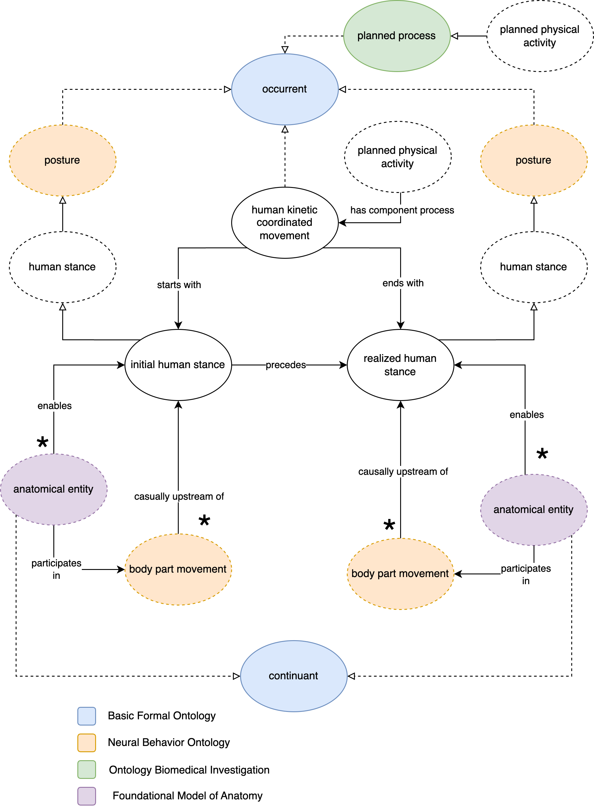

# Kinetic Human Movement Ontology (KHMO)

The Kinetic Human Movement Ontology is an ontological representation of physiological movement of homo sapiens. The ontology models the contributing entities that are involved in motion of from one physical stance to another physical stance (ending stance). The ontology utilizes several major OBO Foundry ontologies' controlled terminologies to form this ontology artifact. 

The figure below abstractly describes the core representation of KHMO that links anatomical entities and names of movements with processes and activities. The model reuses terminologies from Foundational Model of Anatomy, Neural Behavior Ontology, and the Ontology for Biomedical Investigation. There are some indirect import to other ontologies, including Basic Formal Ontology.

## Development

### Term reuse and extraction

- the following folders contain information on extracting the terms:
	- "fma workspace"
	- "nbo workspace"
	- "obi workspace"

- khmo-base.owl is the artifact work file that imports the extracted .owl files from the mentioned workspaces. 

- "merge-workspace" contains information to create the final artifact: khmo.owl

## Permanent URL (PURL) for access 

* http://w3id.org/khmo 

Use [Protege](https://protege.stanford.edu/) to view by importing or opening KHMO using the PURL.

### Opening by URL

- File > Open From URL
- type or paste the PURL

### Opening as an import

Under the "Ontology Imports" tab click the "+" button for Direct Imports and use the provided PURL.

## Developers and contributors

* Eloisa Ngyuen, Seattle Pacific University
* Tuan Amith, University of Texas Medical Branch
* Vivian Ha, Rice University

## License

KHMO is licensed under the Creative Commons Attribution 4.0 International Public License(CC BY 4.0). Please see the License File for more information.